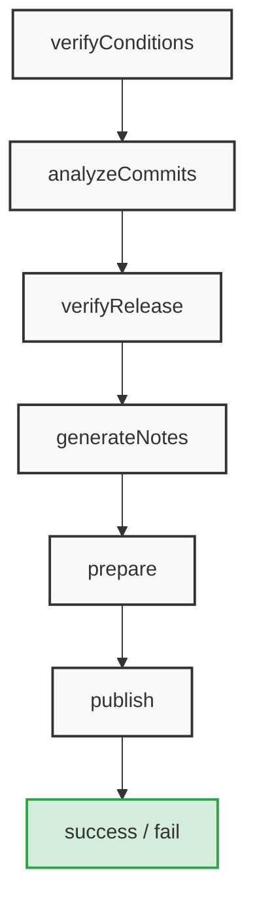

# :star: Repository Template

[](https://github.com/stairwaytowonderland/repository-template/actions/workflows/ci.yaml)
[](https://github.com/stairwaytowonderland/repository-template/releases)
[](https://github.com/stairwaytowonderland/repository-template/commits/main)
[](https://github.com/stairwaytowonderland/repository-template/tree/main/LICENSE)
[](https://github.com/semantic-release/semantic-release)
[](https://github.com/pre-commit/pre-commit)

## :pushpin: Overview

A minimal starting point for a basic repository. :ocean: :surfer: :rocket: :earth_americas: :tada:

## :cactus: Project structure

> [!TIP]
>
> For the `.github` folder file structure, see its [`index.md`](./.github/index.md).

<details>
<summary><b>Project file structure</b> <i>(click to expand) ...</i></summary><br>

> :seedling: `tree -a -F -L 2 -I '.git|.vscode' --gitignore --dirsfirst .`

```none
./
├── .github/
│   ├── workflows/
│   ├── CODEOWNERS
│   ├── dependabot.yml
│   └── index.md
├── script/
│   └── release*
├── .editorconfig
├── .gitignore
├── .markdownlint.json
├── .pre-commit-config.yaml
├── .prettierignore
├── .prettierrc
├── LICENSE
├── README.md
├── TODO.csv
└── TODO.example.csv
```

</details>

---
<!-- REMOVE BELOW -->

## :rocket: Getting started

### :white_check_mark: First tasks

- [ ] **:one: :clipboard: Create your repo:** Use this template to
[**Create your own project**](#clipboard-create-your-own-project)! :tada:
- [ ] **:two: :label: Create some labels:** Run the [Create Labels](https://github.com/stairwaytowonderland/repository-template/actions/workflows/create-labels.yaml)
_workflow_ to create some additional useful labels.
- [ ] **:three: :bookmark: Create some issues:** Run the [Import Issues from CSV](https://github.com/stairwaytowonderland/repository-template/actions/workflows/import-csv-issues.yaml)
  _workflow_ to import first issues using the provided sample _`TODO.csv`_.
- [ ] **:four: :ticket: Complete the _Dependabot Test_:**
  Review, approve, and merge the _Pull Request (**PR**)_ generated by **dependabot**.

  > :memo: The **PR** should have a title similar to the following:
  >
  > ```none
  > chore(deps): bump actions/checkout from 6 to X
  > ```

- [ ] **:five: :wrench: Customize your _project_:**
  Customize the [`README.md`](./README.md), [`CODEOWNERS`](./.github/CODEOWNERS), [`LICENSE`](./LICENSE), and any other
  docs or config _files_, to include project-specific
  information and instructions.
- [ ] **:six: :trophy: _(BONUS)_ :art: Install `pre-commit`:** Install `pre-commit` locally
and configure it (using [.pre-commit-config.yaml](./.pre-commit-config.yaml)) to ensure proper formatting, mitigating
workflow failures.
_(See [Development Guidelines](https://github.com/stairwaytowonderland/repository-template?tab=contributing-ov-file#development-guidelines) for details)_

### :clipboard: Create Your Own Project

To create your own project, you can use this repository as a template! Just
follow the below instructions:

#### :a: _Option "A"_

**Use this template _(recommended)_**

1. Click the **Use this template** button at the top of the repository
1. Select **Create a new repository**
1. Select an owner and name for your new repository
1. Click **Create repository**
1. Clone your new repository

> [!IMPORTANT]
>
> :classical_building: Make sure to remove or update the [`CODEOWNERS`](./CODEOWNERS) file!<br>_(For
> details on how to use this file, see
> [About code owners](https://docs.github.com/en/repositories/managing-your-repositorys-settings-and-features/customizing-your-repository/about-code-owners).)_
>
> :books: Make sure to  update the [`README.md`](./README.md) and the [`LICENSE`](./LICENSE) files accordingly!

#### :b: _Option "B"_

<details>
<summary><b>Manual Creation</b> <i>(Click to expand) ...</i></summary>

1. **Clone this repo:**

    ```bash
    git clone git@github.com:stairwaytowonderland/repository-template.git
    ```

1. **Create a new empty repo:**

    Use the **_UI_** to [create a new repository](https://github.com/new).

1. **Initialize from the command line:**

    ```bash
    # Change directory into the cloned template
    cd /path/to/cloned/template

    # Delete the .git folder from cloned template
    rm -rf .git

    # Optionally overwrite the README with your content
    echo "# Repository Template" > README.md

    # Initialize new git local repository
    git init

    # Set default branch
    git branch -M main

    # Make first commit empty to allow easier rebasing
    git commit --no-verify --allow-empty -m "chore: initial empty commit"

    # Install pre-commit hooks
    # (make sure `pre-commit` is installed ... install it using `pip` or `brew`)
    pre-commit install

    # Add all files (make sure your .gitignore file is properly configured)
    git add .

    # Second commit
    git commit -m "chore: adding initial files"

    # Set the remote to the new repo you manually created (step 2) ...
    # To update the url (instead of add), use `git remote set-url origin <GIT_URL>`
    git remote add origin git@github.com:<user-or-org>/<new-empty-repo>.git

    # Push to remote
    git push -u origin main
    ```

</details>

## :package: Publishing a New Release

This template uses **`semantic-release`** with the _conventionalcommits_ preset by default.

### :label: Creating Tags and Releases

The **creation of tags and releases is handled _automatically_** by the pre-configured [_workflows_](./.github/workflows/).

_Default [`package.json`](https://github.com/stairwaytowonderland/node-semantic-release/blob/main/templates/package.json)
and [`.releaserc`](https://github.com/stairwaytowonderland/node-semantic-release/blob/main/templates/releaserc.json)
files_ will be used instead of being included in this template, however those files can be copied into this project for
additional customizations, such as [including a `CHANGELOG`](#page_with_curl-including-a-changelog).

> [!TIP]
>
> In most cases, only the `.releaserc` needs to by _copied/customized_.

### :page_with_curl: Including a `CHANGELOG`

<details>
<summary><b>To have the generated <code>CHANGELOG</code> committed automatically </b>
<i>(Expand for details) ...</i></summary>

1. Copy the _default [.releaserc](https://github.com/stairwaytowonderland/node-semantic-release/blob/main/templates/releaserc.json)_
file into your project.
2. Add the `@semantic-release/git` _plugin_ configuration **to the end of the _plugins_ section** (**just before
`semantic-release-export-data`**) in your [`.releaserc`](./.releaserc):

    ```json
    [
      "@semantic-release/git",
      {
        "assets": ["CHANGELOG.md"],
        "message": "chore(release): ${nextRelease.version}\n\n${nextRelease.notes}"
      }
    ]
    ```

    > :memo: **Note:**
    > If using an altered or different `.releaserc` file, you must also **ensure the `@semantic-release/changelog`
    > _plugin_ is configured (before the `git` _plugin_**;
    > see [**_"RC"_ Plugin ordering**](#electric_plug-rc-plugin-ordering) for more information):
    >
    > ```json
    > [
    >   "@semantic-release/changelog",
    >   {
    >     "changelogFile": "CHANGELOG.md"
    >   }
    > ]
    > ```

### :electric_plug: _"RC"_ Plugin ordering

The **order of _plugins_ DOES matter** in the _release configuration file (`.releaserc`)_!

:1234: The recommended order for the _`plugins` array_ is:

```json
[
    "@semantic-release/commit-analyzer",
    "@semantic-release/release-notes-generator",
    "@semantic-release/changelog",
    "@semantic-release/npm",
    "@semantic-release/git",
    "@semantic-release/github",
    "semantic-release-export-data"
]
```

#### Why This Exact Order Matters

- [@semantic-release/commit-analyzer](https://github.com/semantic-release/commit-analyzer): Must go first to scan your
commits and determine the next semantic version bump
(_major_, _minor_, or _patch_).
- [@semantic-release/release-notes-generator](https://github.com/semantic-release/release-notes-generator): Compiles
the release notes based on those commits.
- [@semantic-release/changelog](https://github.com/semantic-release/changelog): Must be placed before the `git` and `npm`
plugins. It creates or updates the physical `CHANGELOG.md` file so downstream plugins can package and commit it.
- [@semantic-release/npm](https://github.com/semantic-release/npm): Must run before the Git plugin. It updates the
version string in package.json. If placed after `git`, the version bump won't be committed to your repository.
- [@semantic-release/git](https://github.com/semantic-release/git): Consolidates the modified CHANGELOG.md and
package.json, then creates the release commit and pushes it back to your repository.
- [@semantic-release/github](https://github.com/semantic-release/github)
(or [`gitlab`](https://github.com/semantic-release/gitlab)): Placed last to finalize the process by publishing the
GitHub Release, uploading build assets, and posting automated comments on resolved issues or PRs.
- [semantic-release-export-data](https://github.com/felipecrs/semantic-release-export-data): Can be placed anywhere in
your plugins array, but the most reliable approach is to add it at the very end of your plugin list.
It does not modify code, commit files, or change your package repository. _It is a passive plugin designed solely to
hook into the prepare, publish, and success [lifecycles](https://semantic-release.org/developer-guide/plugin/) to extract data generated by previous steps (like the version
determined by the `commit-analyzer`) and write it out as environment/GitHub Actions variables._

See the [**official docs**](https://semantic-release.org/developer-guide/plugin/) for more information.

#### How the Steps Execute Internally



</details>

## :paintbrush: Further customizations

### :fountain_pen: Contributing details

For customized **contributing details**, create a **`CONTRIBUTING.md`** in this repo:

```bash
echo "# Contributing Guidelines" > CONTRIBUTING.md
```

> [!TIP]
>
> You may copy this organization's [`CONTRIBUTING.md`](https://github.com/stairwaytowonderland/.github/blob/main/CONTRIBUTING.md)
> file as a starting point.

### :lady_beetle: Issues and PRs

For simplicity reasons, this template repo doesn't include the **`ISSUE_TEMPLATE`** and **`PULL_REQUEST_TEMPLATE`** _(.md)_
files.

> [!NOTE]
>
> **_If using this template in another org_, or to _add those files to your project for further customization_**, copy
> them from this organization's [_special .github repo_](https://github.com/stairwaytowonderland/.github/tree/main/.github).

## :ocean: Essential tools

- :white_check_mark: [Visual Studio Code](https://code.visualstudio.com/) (a.k.a. _VS Code_)
- :white_check_mark: [EditorConfig](https://editorconfig.org/)
- :white_check_mark: [pre-commit](https://pre-commit.com/)
- :white_check_mark: [Prettier](https://prettier.io/)

  > :memo: **Note:** For a more customized experience, some files might need to be excluded from _Prettier_.
  >
  > See the [official docs](https://prettier.io/docs/ignore) for details on ignoring code.

---
<!-- REMOVE ABOVE -->

## :sparkles: Contributing

### :speech_balloon: Commit Message Guidelines

- Write clear, concise commit messages that follow the
  [](https://www.conventionalcommits.org/)&nbsp;standard.
- The allowed _prefixes_ for this project are the following:

    ```json
    [
      "build",
      "chore",
      "ci",
      "docs",
      "feat",
      "fix",
      "perf",
      "refactor",
      "revert",
      "style",
      "test"
    ]
    ```

> [!NOTE]
>
> See [Contributing Guidelines](https://github.com/stairwaytowonderland/repository-template?tab=contributing-ov-file#contributing-guidelines)
> for more information.
